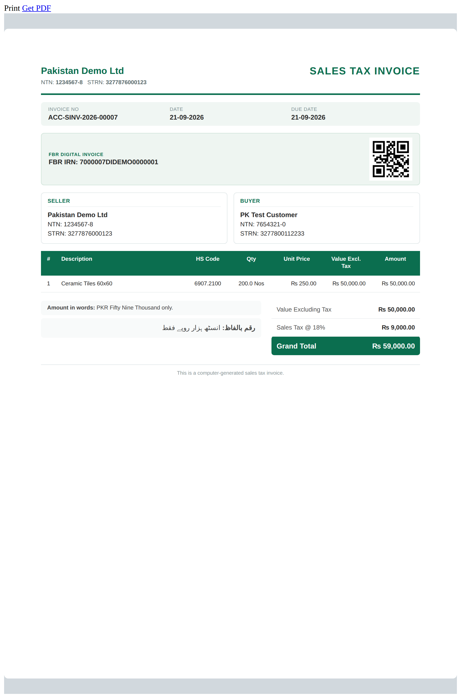
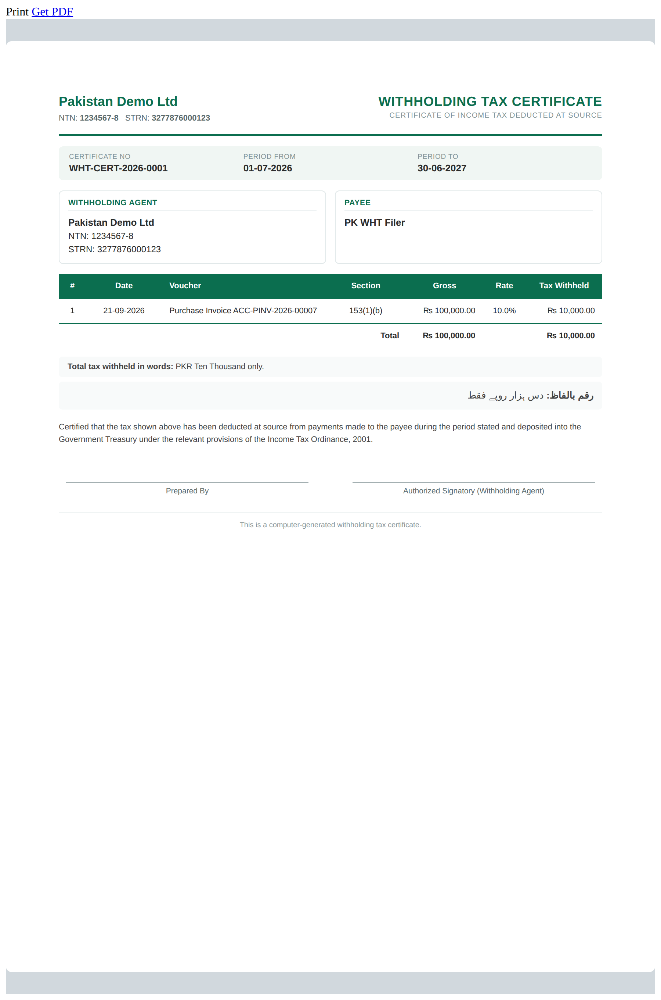
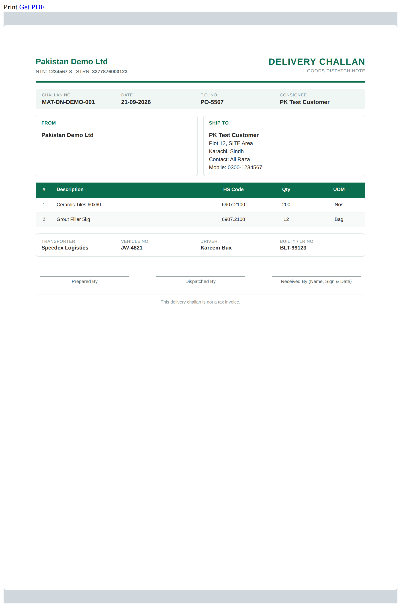
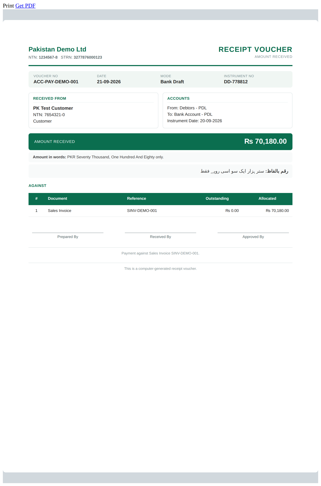
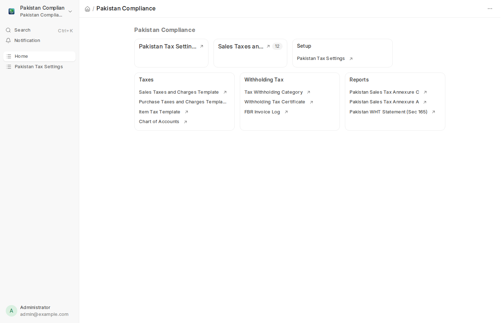

<div align="center">
	

# Pakistan Compliance

**Pakistan localization for ERPNext** — FBR sales tax invoices, tax setup,
withholding tax, professional print formats, FBR Digital Invoicing, and sales-tax
return reports.

[](license.txt)
&nbsp; ERPNext **v15** & **v16**

</div>

---

## What it is

Pakistan Compliance makes a Pakistani business tax-compliant and locally
presentable inside ERPNext. It ships the master data, the federal/provincial tax
setup, withholding tax with filer/non-filer (ATL) awareness, a set of clean
FBR-style print formats, real-time **FBR Digital Invoicing** (Invoice Reference
Number + QR), and the sales-tax return annexures — all as native Frappe/ERPNext
features (DocTypes, buttons, print formats, reports), not a bolted-on UI.

It is the Pakistan counterpart to the KSA localization apps (`ksa_print_formats`,
`zatca`), kept deliberately as **one app**.

## Features

- **Master data & settings** — NTN, STRN, CNIC, Filer/Non-Filer (ATL) status, HS
  Code and Province custom fields on the standard doctypes; a **Pakistan Tax
  Settings** single DocType (FBR environment, credentials, defaults).
- **Tax setup automation** — one click creates the Chart-of-Accounts tax accounts
  and Sales/Purchase Taxes and Charges Templates: federal sales tax on goods
  (18%), further tax (3%), provincial sales tax on services (SRB/PRA/KPRA/BRA/ICT),
  zero-rated and exempt, plus input-tax equivalents. Idempotent; rates are
  editable, never hard-coded as permanent truth.
- **Print formats** — a green, consistent FBR-style design system: **Sales Tax
  Invoice**, **Credit Note**, **Sales Order**, **Delivery Challan**, **Purchase
  Order**, **Quotation** and **Payment/Receipt Voucher**, each with seller/buyer
  NTN·STRN, HS codes, tax breakdown, and **English + Urdu amount in words**. Set
  as the default print format for each document on install.
- **Withholding tax + ATL** — Tax Withholding Categories per income-tax section
  (153(1)(a) goods, 153(1)(b) services, 153(1)(c) contracts, 233 commission, 155
  rent) in **Filer** and **Non-Filer** variants, seeded with the current FBR rate
  card; withholding computes and posts on Purchase Invoices on both ERPNext v15
  and v16. A submittable **Withholding Tax Certificate** with a printable format.
- **FBR Digital Invoicing** — a thin client for the FBR/PRAL Digital Invoicing
  API. A **Report to FBR** button on the Sales Invoice posts the invoice, stores
  the returned Invoice Reference Number (IRN) in an **FBR Invoice Log**, and
  prints the **IRN + QR** on the sales tax invoice. Sandbox and production
  environments, with scenario support for sandbox testing.
- **Reports** — **Sales Tax Annexure C** (sales) and **Annexure A** (purchases)
  for the FBR sales tax return, plus a **Withholding Tax Statement (Sec 165)**;
  the totals reconcile with the posted invoices for the period.

## Screenshots

| FBR Sales Tax Invoice (with IRN + QR) | Withholding Tax Certificate |
| --- | --- |
|  |  |

| Delivery Challan | Payment / Receipt Voucher |
| --- | --- |
|  |  |

**Workspace**



## Compatibility

| ERPNext / Frappe | Branch |
| --- | --- |
| **v15** | `main` |
| **v16** | `version-16` |

The two branches are kept in step; only `[tool.bench.frappe-dependencies]` in
`pyproject.toml` differs.

## Installation

From your bench directory, on the branch that matches your ERPNext version:

```bash
# ERPNext v15
bench get-app https://github.com/sowaan/pakistan_compliance --branch main

# ERPNext v16
bench get-app https://github.com/sowaan/pakistan_compliance --branch version-16

bench --site <your-site> install-app pakistan_compliance
```

Installing pulls in one Python dependency each: `indic-numtowords` (Urdu
amount-in-words) and `qrcode` (the FBR invoice QR). Pillow ships with Frappe.

## Usage

1. **Set your tax identity.** Open **Pakistan Tax Settings** and fill in the FBR
   environment; add your company's NTN/STRN on the Company. Customers/Suppliers
   gain a **Pakistan Tax** section (NTN, STRN, CNIC, Filer Status) under the Tax
   tab; Items gain an **HS Code**; Addresses gain a **Province**.
2. **Create the tax accounts & templates.** On Pakistan Tax Settings click
   **Set up Pakistan Taxes** and pick a Company. Re-runnable and safe.
3. **Set up withholding tax.** Click **Set up Withholding Tax** to create the WHT
   payable account and the Filer/Non-Filer categories. Assign the matching
   category to each supplier; WHT then deducts automatically on Purchase Invoices.
4. **Print.** The Pakistan print formats are the default for Sales Invoice, Sales
   Order, Delivery Note, Purchase Order, Quotation and Payment Entry. Toggle the
   Urdu amount-in-words line under Pakistan Tax Settings → Print Formats.
5. **Report to FBR.** With the FBR integrator token set on Pakistan Tax Settings,
   submit a Sales Invoice and click **Report to FBR** to get the IRN + QR.
6. **File.** Run **Pakistan Sales Tax Annexure C / A** and the **WHT Statement
   (Sec 165)** from the workspace for a period; export as needed.

## Notes & guardrails

- **Verify tax rates against current law.** Pakistani rates change with each
  Finance Act and SROs. The seeded rates are the current defaults with their
  source noted in code; they live in editable Tax Templates / Categories. Confirm
  them for your period before filing.
- **FBR is the source of truth for e-invoicing.** The Digital Invoicing client
  targets the FBR/PRAL sandbox and production API; test against the live sandbox.
  A real integrator token (from the FBR IRIS portal) is required to report.
- **Credentials are stored encrypted** (Frappe `Password` fields) and never logged.

## License & pricing

MIT-licensed (see `license.txt`) and **free**. The app is a localization layer;
any cost is your own FBR/PRAL Digital Invoicing subscription, not the connector.

## Support

By Sowaan — support@sowaan.com. Issues and contributions welcome on the
[GitHub repository](https://github.com/sowaan/pakistan_compliance).
